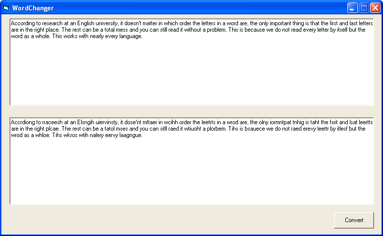



## Change order of letters in a word

### Description

This code is just for fun, it demostrates an interesting phenomenon and some ways to manipulate strings, and arrays. According to research at an English university, it doesn't matter in which order the letters in a word are, the only important thing is that the first and last letters

are in the right place. The rest can be a total mess and you can still read it without a problem. This is because we do not read every letter by itself but the

word as a whole. This works with nearly every language. IMPORTANT: A similar program was posted a little before mine, but I posted mine without knowledge of that, and without seeing any portion of the code. This program (and I'm sure the other one too) was inspired in an email that got forwarded around the world a few days ago. The main difference between my program and the other one is that this one uses a byte array and totally randomizes the order of the words, the other program merely reverses the order of the letters. Thank you.
 
### More Info
 

             |
---                |---
**Submitted On**   |2003-09-23 22:25:38
**By**             |[Luis Cantero](https://github.com/Planet-Source-Code/PSCIndex/blob/master/ByAuthor/luis-cantero.md)
**Level**          |Beginner
**User Rating**    |5.0 (35 globes from 7 users)
**Compatibility**  |VB 6\.0, VB Script, ASP \(Active Server Pages\) 
**Category**       |[String Manipulation](https://github.com/Planet-Source-Code/PSCIndex/blob/master/ByCategory/string-manipulation__1-5.md)
**World**          |[Visual Basic](https://github.com/Planet-Source-Code/PSCIndex/blob/master/ByWorld/visual-basic.md)
**Archive File**   |[Change\_ord1649299232003\.zip](https://github.com/Planet-Source-Code/luis-cantero-change-order-of-letters-in-a-word__1-48705/archive/master.zip)

